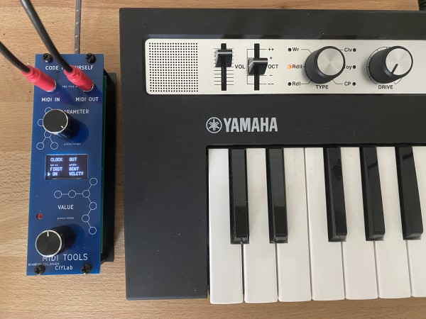

## À quoi ça sert ?

Intercalé entre un clavier et un synthétiseur en MIDI, ce petit module prend le
signal et le transforme à volonté en fonction des algorithmes disponibles.

## Exemple de configuration 

Branché en loopback sur un Yamaha reface CP (entrée <-> sortie) il permet
d'enregistrer des séquences pour les jouer en boucle. Ce synthétiseur étant
polyphonique, on peut très bien l'utiliser simultanément pour une ligne de 
basse et un lead.

